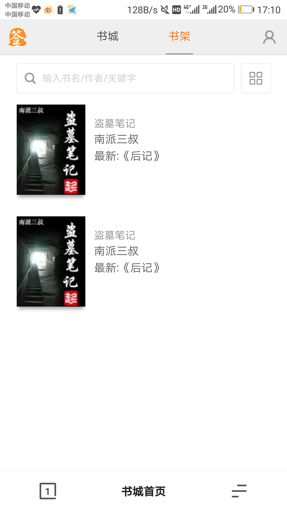
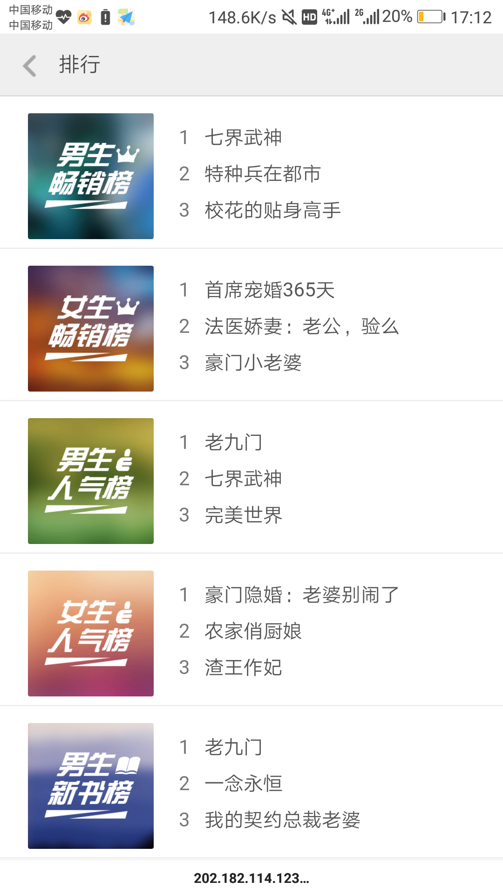
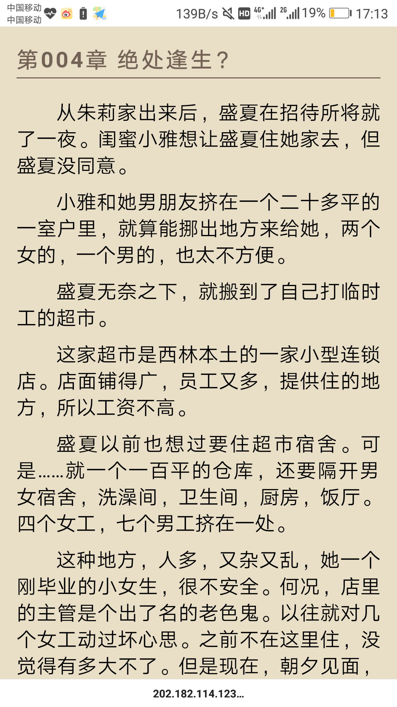
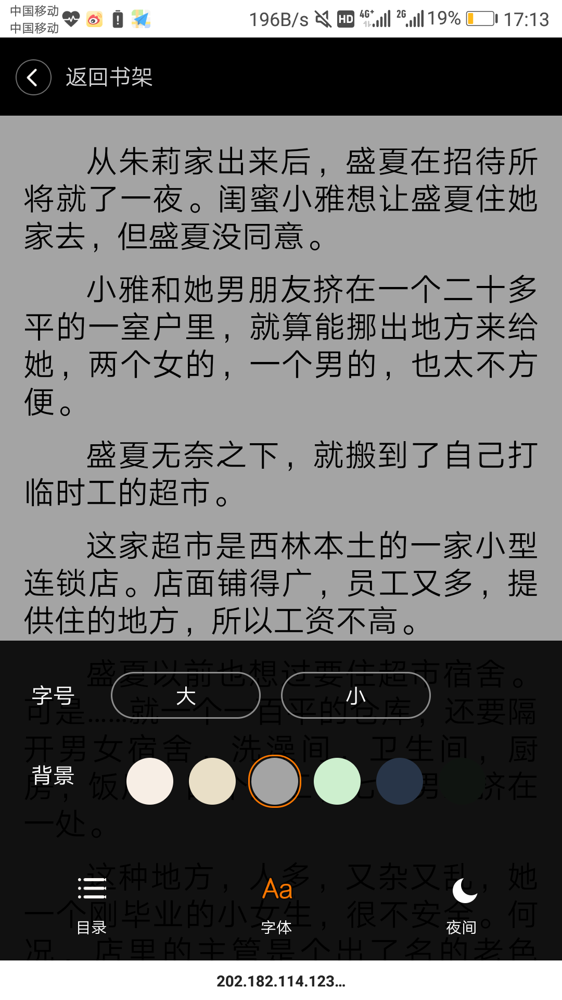
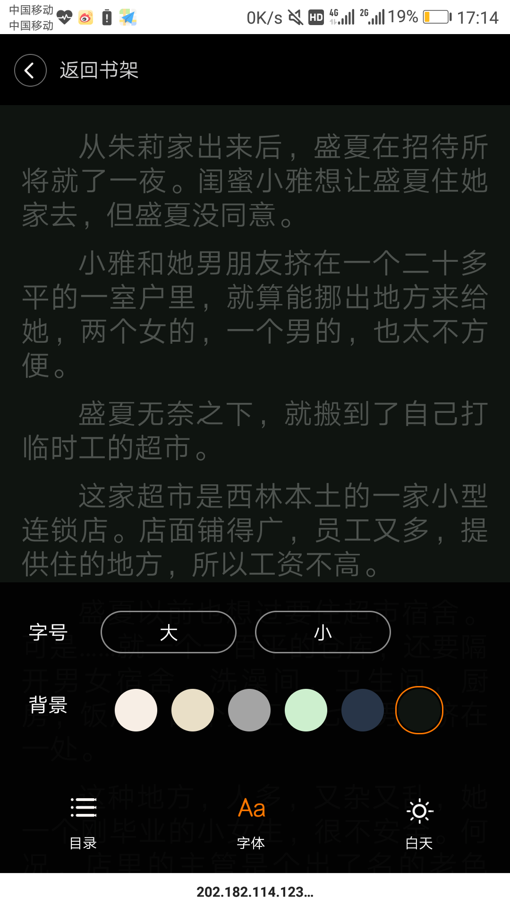

---
# BookReader

>Online bookstore and bookreader based on html5、vue、koa.

Welcome to : [在线书城](http://seele.moe:3001).

---

#### Home page:  
 

 

#### Personal page;：
 

  
 

 

#### Bookreader：
 

 

---

#### How to use
* install dependencies
> npm install

* serve with hot reload at localhost:3001
> node app.js
